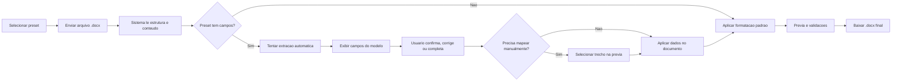

# Roadmap de Evolucao dos Modelos Institucionais

## Objetivo

Evoluir o formatador atual sem fugir da logica que ja existe hoje.

O sistema continua baseado em presets como `ABNT` e `Artigo`, mas alguns presets passam a ter:

- parametros visuais
- campos especificos do modelo
- regras de leitura do arquivo enviado
- regras de validacao
- mapeamento manual assistido quando a extracao automatica falhar

Principio central:

- o upload de `.docx` continua existindo em todos os fluxos
- o arquivo enviado continua sendo o centro da experiencia
- os campos nao substituem o documento
- os campos ajudam o sistema a ler, revisar, completar e padronizar o documento enviado

---

## Checklist de progresso

### Base do produto

- [x] manter upload em todos os fluxos
- [x] manter logica de presets como eixo principal do sistema
- [x] manter `ABNT` como preset visual puro
- [x] eleger `Artigo` como primeiro preset com campos

### Infraestrutura inicial do preset Artigo

- [x] expandir o schema inicial do preset `Artigo` com `fieldsEnabled`
- [x] registrar os campos principais do primeiro ciclo
- [x] criar painel `Campos do artigo` na interface
- [x] criar estados visuais dos campos
- [x] permitir edicao manual dos campos
- [x] forcar `Antes = 0` e `Depois = 0` nos paragrafos processados

### Leitura inicial do documento

- [x] estruturar helpers de leitura da previa
- [x] implementar extracao automatica simples para os primeiros campos do `Artigo`
- [x] medir e exibir nivel de confianca da estrutura na interface
- [x] exibir sinal visual de `structureHints` reconhecidos

### Mapeamento e aplicacao

- [x] fazer prova de conceito para substituicao com runs fragmentados
- [x] implementar mapeamento manual assistido por paragrafo
- [x] aplicar `mappingRules` no corpo do documento com `sourceRef`
- [x] impedir substituicao silenciosa quando a estrutura nao for reconhecida

### Camada editorial futura

- [x] registrar tecnicamente o artigo-modelo de referencia
- [x] registrar os campos variaveis editoriais e bibliograficos
- [x] tratar `header*.xml` e `footer*.xml`
- [x] suportar primeira pagina especial por template
- [x] suportar DOI, datas editoriais e citacao curta via template
- [x] derivar automaticamente a citacao curta do rodape a partir de autor, titulo e contexto editorial

### Melhorias de UX

- [x] substituir `alert()` por feedback visual no layout
- [x] implementar estado `Personalizado` quando o preset ativo for alterado manualmente
- [x] criar previa viva basica para fonte, espacamento, alinhamento e recuo
- [x] ampliar a area de drag and drop para troca de arquivo na coluna esquerda
- [x] fixar CTA principal no rodape em telas pequenas
- [x] reforcar visualmente quando o preset `Artigo` ativa recursos avancados
- [x] dividir a barra lateral em abas de `Estilo`, `Campos` e `Analise`
- [x] aplicar scroll independente na area principal da barra lateral

---

## Decisao de produto

Resumo aprovado:

- `Preset sem campos` = usuario envia o arquivo e o sistema formata
- `Preset com campos` = usuario envia o arquivo, o sistema tenta ler o conteudo, mostra campos do modelo, o usuario corrige ou completa, e o sistema formata no padrao

Isso evita criar dois produtos paralelos.

O usuario institucional geralmente ja chega com:

- um rascunho
- um modelo base
- um documento quase pronto
- um arquivo padrao que precisa de pequenos ajustes

Entao o sistema deve aproveitar esse arquivo, nao obrigar o usuario a recomecar.

---

## Fluxo principal



---

## Regra funcional principal

Todo preset passa a poder ter duas camadas.

### 1. Camada visual

- fonte
- tamanho
- espacamento
- margens
- alinhamento
- triagem ou validacoes visuais

### 2. Camada estrutural

- campos do modelo
- regras de extracao do arquivo
- regras de mapeamento para aplicacao no documento
- validacoes especificas
- suporte a mapeamento manual assistido

---

## Estrutura proposta para presets

Hoje o preset ja tem:

- `id`
- `name`
- `articleReview`
- `values`

Proposta de evolucao:

```js
{
  id: 'artigo',
  name: 'Artigo',
  builtIn: true,
  articleReview: true,
  values: {
    fonte: 'Bodoni MT',
    sizeNormal: 12,
    sizeCompact: 10,
    spacingNormal: '1',
    spacingCompact: '1',
    indentFirst: 1.25,
    mTop: 2,
    mBottom: 2,
    mLeft: 2,
    mRight: 2,
    chkAlign: false
  },
  fieldsEnabled: true,
  fields: [...],
  extractionRules: [...],
  mappingRules: [...],
  validations: [...],
  structureHints: [...],
  manualMapping: {
    enabled: true,
    mode: 'paragraph'
  }
}
```

### Propriedades novas

- `fieldsEnabled`
  - indica se o preset exibe campos especificos

- `fields`
  - define os campos do modelo

- `extractionRules`
  - define como o sistema tenta localizar valores no arquivo enviado

- `mappingRules`
  - define onde o valor confirmado deve ser aplicado

- `validations`
  - regras especificas do preset

- `structureHints`
  - sinais minimos para medir o quanto a estrutura do documento combina com o preset

- `manualMapping`
  - configura se o preset permite apontar o trecho manualmente na previa

---

## Estrutura proposta para campos

Cada campo precisa ser mais rico do que um simples input.

Exemplo conceitual:

```js
{
  id: 'titulo_pt',
  label: 'Titulo em portugues',
  type: 'text',
  required: true,
  applyMode: 'replace',
  allowManualMap: true,
  sourceState: 'detected_auto',
  confidence: 'medium',
  sourceRef: null,
  validation: [
    { type: 'min_length', value: 10 }
  ],
  generation: {
    type: 'manual'
  }
}
```

### Campos importantes no schema

- `applyMode`
  - `suggest`
  - `replace`
  - `insert`

- `allowManualMap`
  - permite apontar manualmente o trecho na previa

- `sourceState`
  - informa de onde veio o valor

- `confidence`
  - informa o grau de confianca da extracao

- `sourceRef`
  - referencia o trecho original do documento

- `generation`
  - prepara campos que no futuro poderao vir de logica local ou de API

---

## Estados visuais dos campos

Isso precisa existir desde o primeiro ciclo de interface.

Estados minimos:

- `Detectado automaticamente`
- `Selecionado no documento`
- `Preenchido manualmente`
- `Nao encontrado`
- `Texto padrao do modelo`

Cada estado precisa aparecer com sinal visual claro no painel de campos.

Objetivo:

- o usuario entender rapidamente de onde veio o valor
- o usuario perceber quando o sistema pode ter interpretado errado
- evitar baixar um documento com informacao incorreta sem revisar

---

## Niveis de confianca da leitura do arquivo

Os presets institucionais nao devem fingir que entenderam o documento quando nao entenderam.

O sistema aceita qualquer `.docx`, mas precisa mostrar o grau de reconhecimento:

### 1. Estrutura reconhecida

- o arquivo parece seguir o modelo esperado
- a extracao tem boa chance de sucesso
- o sistema pode preencher mais campos automaticamente

### 2. Estrutura parcialmente reconhecida

- o sistema encontrou apenas parte do que esperava
- os campos aparecem com mistura de sugestoes e vazios
- o usuario precisa revisar

### 3. Estrutura nao reconhecida

- o sistema nao encontrou sinais suficientes do modelo
- os campos podem aparecer vazios
- o sistema ainda permite formatar
- o sistema ainda permite mapear manualmente
- o sistema nao deve aplicar substituicoes silenciosas

Essa politica vale especialmente para presets institucionais como `Despacho de bens`.

---

## Mapeamento manual assistido

Quando a extracao automatica falhar ou vier errada, o sistema precisa oferecer um plano B oficial.

Nome recomendado para o conceito:

- `mapeamento manual assistido`

Ideia:

- o sistema tenta extrair primeiro
- se nao encontrar ou encontrar errado, o usuario pode apontar o trecho certo na previa
- o campo passa a usar aquele trecho como origem

### Niveis de interatividade

#### Nivel 1 - Selecionar o paragrafo inteiro

Primeira entrega recomendada.

Comportamento:

- o usuario clica em `Selecionar no documento`
- a previa entra em modo de selecao
- cada paragrafo fica clicavel
- o usuario clica no paragrafo desejado
- o campo recebe aquele conteudo

Bom para:

- titulo
- resumo
- abstract
- bloco de texto
- palavras-chave em linha propria

#### Nivel 2 - Selecionar texto com o mouse

Evolucao futura.

Bom para:

- data
- numero de processo
- assunto dentro de uma linha maior

#### Nivel 3 - Selecionar intervalo fino

Nao e prioridade inicial.

Se algum dia entrar, deve ser tratado como evolucao posterior.

### Regra de produto

O ciclo inicial deve implementar apenas:

- extracao automatica
- selecao manual por paragrafo

---

## Requisito tecnico da previa

A previa nao pode ser apenas texto renderizado sem origem tecnica.

Para o mapeamento manual funcionar, cada bloco da previa precisa ter referencia ao documento original.

Cada paragrafo da previa deve carregar algo equivalente a:

- indice do paragrafo
- origem do arquivo
- referencia ao no correspondente no XML
- texto normalizado usado na exibicao

Exemplo conceitual:

```js
{
  paragraphIndex: 12,
  sourceFile: 'word/document.xml',
  text: 'Resumo',
  sourceRef: {
    paragraphIndex: 12
  }
}
```

Sem isso, a interacao visual nao se converte em alteracao real no `.docx`.

---

## Risco tecnico principal: runs fragmentados

Este e o ponto tecnico mais critico do roadmap.

No `.docx`, o texto pode vir quebrado em varios `w:r` e `w:t`.

Exemplo:

```xml
<w:r><w:t>Tit</w:t></w:r>
<w:r><w:t>ulo</w:t></w:r>
<w:r><w:t> do Artigo</w:t></w:r>
```

Entao localizar e substituir conteudo nao e simplesmente trocar uma string.

O sistema precisa decidir como vai:

- localizar o trecho logico
- recompor o texto visivel
- substituir sem destruir formatacao
- preservar `rPr` sempre que possivel

Conclusao:

- isso nao e detalhe de implementacao
- isso e a prova tecnica central das fases de extracao e aplicacao

---

## Fase 0 obrigatoria

Antes de abrir as fases principais, precisa existir uma prova de conceito isolada.

### Fase 0 - Prova de conceito de substituicao em Word XML

Objetivo:

- provar que conseguimos localizar e alterar texto em `.docx` com runs fragmentados

Escopo:

- ler paragrafo com varios runs
- recompor texto para busca
- substituir valor sem destruir o documento
- validar o que acontece com formatacao

Resultado esperado:

- definir a estrategia real de `mappingRules`
- medir limites do que sera seguro automatizar

Sem essa fase, a Fase 3 e a Fase 4 ficam otimistas demais.

---

## Extracao automatica: limites reais

`extractionRules` sao uteis, mas dependem de alguma convencao no documento.

Exemplos reais:

- `Resumo`
- `RESUMO`
- `Resumo:`
- bloco sem titulo claro

Entao a extracao automatica deve ser tratada como:

- tentativa assistiva
- nao como verdade definitiva

Regras de UX:

- se extraiu, mostrar de onde veio
- se a confianca for baixa, destacar isso
- se falhou, mostrar campo vazio sem esconder o problema
- oferecer mapeamento manual assistido

---

## Politica para arquivos que nao combinam com o preset

Decisao explicita:

- o sistema aceita qualquer `.docx`
- mas nao deve aplicar automacoes estruturais silenciosamente quando a estrutura nao combinar com o preset

Em presets como `Despacho de bens`, o comportamento deve ser:

- se a estrutura parece compativel, sugerir e aplicar com mais seguranca
- se a estrutura e parcial, mostrar sugestoes com revisao obrigatoria
- se a estrutura nao combina, manter campos vazios ou padrao e oferecer mapeamento manual

Isso preserva flexibilidade sem gerar falsa confianca.

---

## Numeracao de controle

Decisao atual:

- nao implementar como prioridade agora
- deixar o schema preparado

Motivo:

- a numeracao institucional oficial pode exigir backend, API ou integracao com fonte central
- gerar numeracao local no navegador pode servir como rascunho, mas nao necessariamente como identificador oficial

Entao o roadmap deve apenas preparar o sistema para 4 cenarios futuros:

- preenchimento manual
- sugestao local
- geracao local provisoria
- geracao por API/backend

Exemplo conceitual:

```js
generation: {
  type: 'manual' // ou 'local-sequence' ou 'api'
}
```

---

## Validacoes especificas por preset

As validacoes precisam nascer extensveis ja na Fase 1.

### Artigo

- paginas minimas e maximas
- presenca de resumo e abstract
- contagem de palavras do resumo
- quantidade de palavras-chave

### Despacho de bens

- setor de origem preenchido
- setor de destino preenchido
- assunto preenchido
- data preenchida
- texto principal nao vazio

E o schema deve aceitar evolucoes futuras como:

- formato do numero de processo
- formato da data
- lista valida de setores
- exigencia de assinatura

---

## Comportamento esperado por tipo de preset

### 1. Preset visual puro

Exemplo: `ABNT`

Comportamento:

- usuario envia arquivo
- sistema formata
- sem painel de campos

### 2. Preset visual + campos de apoio

Exemplo: `Artigo`

Comportamento:

- usuario envia arquivo
- sistema tenta identificar informacoes principais
- sistema mostra campos do modelo
- usuario confirma, corrige ou aponta trechos manualmente
- sistema aplica ajustes pontuais
- sistema roda triagem especifica
- sistema formata e baixa

### 3. Preset institucional com preenchimento dirigido

Exemplo: `Despacho de bens`

Comportamento:

- usuario envia um arquivo base, rascunho ou documento quase pronto
- sistema mede o nivel de reconhecimento da estrutura
- sistema mostra os campos do modelo
- usuario completa o que estiver faltando
- usuario pode mapear manualmente os trechos principais
- sistema substitui, completa ou insere dados de forma controlada
- sistema padroniza o documento no preset correspondente

---

## Comportamento da interface

Sem fugir do que ja existe hoje.

### Coluna da direita

Continua com:

- presets
- parametros visuais
- botao de gerar

E ganha um bloco condicional:

- `Campos do modelo`

Esse bloco deve:

- mostrar estado visual dos campos
- mostrar confianca da extracao
- permitir editar manualmente
- oferecer `Selecionar no documento` quando couber

### Coluna da esquerda

Continua com:

- upload
- documento
- previa

Mas passa a refletir a leitura do arquivo:

- trechos detectados
- destaque de paragrafos selecionaveis quando estiver em modo de mapeamento
- origem dos dados confirmados

---

## Arquitetura de codigo

Mesmo mantendo uma pagina so, o crescimento do `format.html` ja e um risco real.

Nao e necessario quebrar em varios arquivos agora, mas a Fase 1 deve separar blocos logicos.

Separacao minima recomendada:

- schema de presets
- renderizacao de campos
- leitura da previa
- extracao automatica
- mapeamento manual
- aplicacao no docx
- triagem e validacoes

Mesmo que tudo ainda fique no mesmo HTML, esses blocos devem nascer bem isolados.

---

## Etapas de implementacao

### Fase 0 - Prova de conceito de substituicao em runs fragmentados

Objetivo:

- validar tecnicamente a substituicao de texto no `.docx`

### Fase 1 - Base de preset expandido

Objetivo:

- permitir presets com campos, validacoes e configuracao de mapeamento

Tarefas:

- expandir a estrutura de preset
- criar `fieldsEnabled`
- criar `fields`
- criar `manualMapping`
- criar `structureHints`
- criar schema extensivel de `validations`
- preservar compatibilidade com presets atuais

### Fase 2 - Painel dinamico de campos

Objetivo:

- exibir e editar campos do preset ativo

Tarefas:

- criar bloco `Campos do modelo`
- renderizar estados visuais dos campos
- mostrar confianca de extracao
- coletar valores preenchidos

### Fase 3 - Extracao inicial do arquivo

Objetivo:

- tentar preencher automaticamente campos a partir do `.docx`

Tarefas:

- criar `extractionRules`
- medir nivel de reconhecimento do documento
- detectar conteudo provavel por preset
- popular campos com sugestoes

### Fase 4 - Mapeamento manual assistido

Objetivo:

- permitir que o usuario aponte o trecho correto na previa

Tarefas:

- ativar modo de selecao por paragrafo
- vincular paragrafo clicado ao campo ativo
- gravar `sourceRef`
- sobrescrever sugestao automatica quando necessario

### Fase 5 - Aplicacao pontual dos campos

Objetivo:

- alterar o documento em pontos especificos de forma controlada

Tarefas:

- criar `mappingRules`
- aplicar `suggest`, `replace` e `insert`
- usar `sourceRef` quando existir
- manter a formatacao geral ja existente

### Fase 6 - Primeiro preset com campos

Sugestao:

- evoluir `Artigo`

Motivo:

- ja existe
- ja tem triagem
- ja tem comportamento especial

### Fase 7 - Primeiro preset institucional novo

Sugestao:

- `Despacho de bens`

Motivo:

- alto valor pratico
- bom piloto para uso interno
- ajuda a validar a camada institucional do produto

---

## Recomendacao pratica imediata

Proximo passo ideal:

1. manter `ABNT` como esta
2. evoluir `Artigo` para o primeiro preset com campos
3. criar o schema expandido
4. definir os estados visuais dos campos
5. fazer a prova de conceito de runs fragmentados
6. depois abrir o painel de campos
7. depois fazer extracao automatica simples
8. depois adicionar mapeamento manual por paragrafo

---

## Resumo executivo

Direcao consolidada para o produto:

- continuar com a logica de presets
- manter o upload em todos os fluxos
- usar campos como camada inteligente sobre o arquivo enviado
- tratar extracao automatica como assistencia, nao como verdade absoluta
- adotar mapeamento manual assistido como fallback oficial
- medir e mostrar o nivel de reconhecimento do documento
- preparar o sistema para validacoes e geracao futura por backend quando necessario

Em resumo:

- `Preset sem campos` = formata
- `Preset com campos` = le o arquivo + tenta extrair + mostra campos + permite mapear manualmente + completa o documento + formata
